# 🖥️ Wealth Intelligence Platform - Postman API Testing Handbook

This handbook outlines the core API architecture, endpoints, and step-by-step test guidelines using **Postman**. It contains exact JSON payloads for all modules, allowing you to test authentication, portfolio holdings, stocks trading, mutual funds, systematic investment plans (SIP), gateway telemetry logging, and administrator controls.

---

## 📸 Premium UI Dashboard Showcase

Witness the platform's state-of-the-art dark-glass financial terminal workspace:

### 👨‍💼 Administrator Workspace UI Showcase

#### 1. Unified Control Center (`Admin Dashboard`)
Real-time statistics counters, nested Mutual Funds and Stocks assets lists, and gateway proxy HTTP log feeds streaming in real-time.
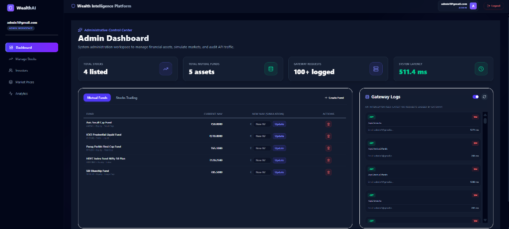

#### 2. Manage Listed Securities (`Manage Stocks`)
Dark glassmorphism listings grid displaying symbols, ISINs, exchanges, available capital pools, and current prices. Includes in-place parameter adjustment modals.
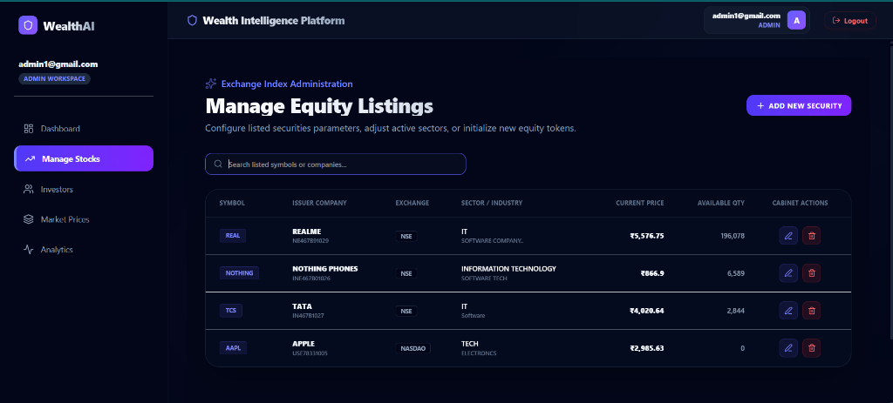

#### 3. Live Market Price Controller (`Market Prices`)
Exposes live pricing inputs and commit actions. Features a **Market Volatility Simulation Engine** that triggers sequential price fluctuations (gains/losses) with live tick telemetry.
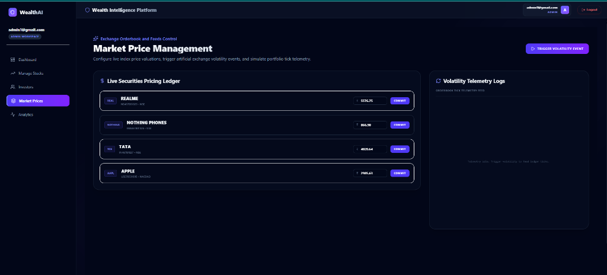

#### 4. Compliance Audits & KYC Registries (`Investors`)
Central auditing console showcasing total active accounts, verified compliance ratios, location tracking, and an instant KYC suspension/approval pipeline.
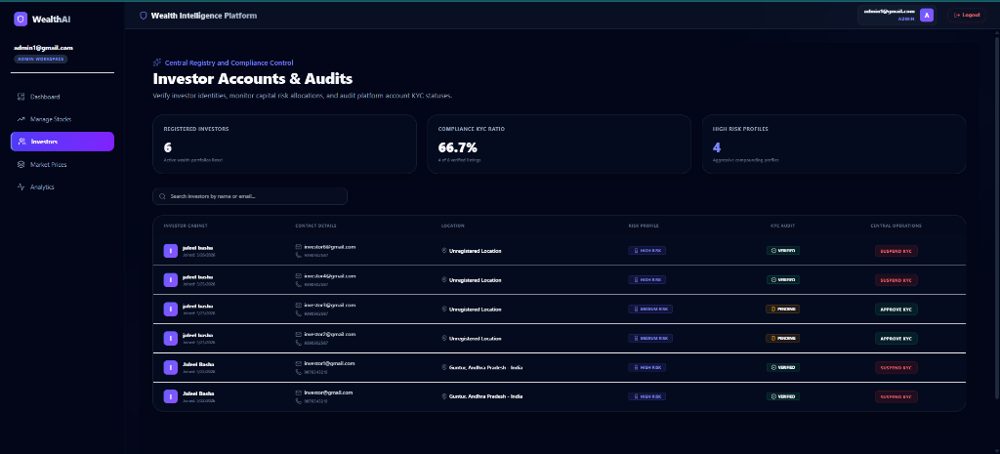

#### 5. Diagnostics & System Latency Timeline (`Analytics`)
Telemetry analytics deck tracking gateway latency timelines, HTTP methods PieChart allocations, successful response ratios, and critical bottleneck lists.
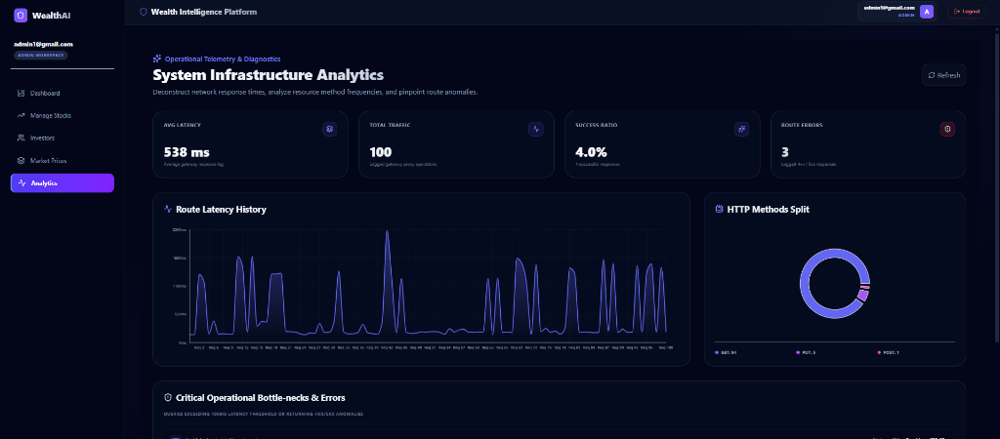

---

### 👤 Investor Workspace UI Showcase

#### 1. Consolidated Portfolio Dashboard (`Portfolio`)
Consolidated portfolio view illustrating Net Investment value cards, Net absolute returns, and visual asset allocations (donuts & cost vs current bar-charts).
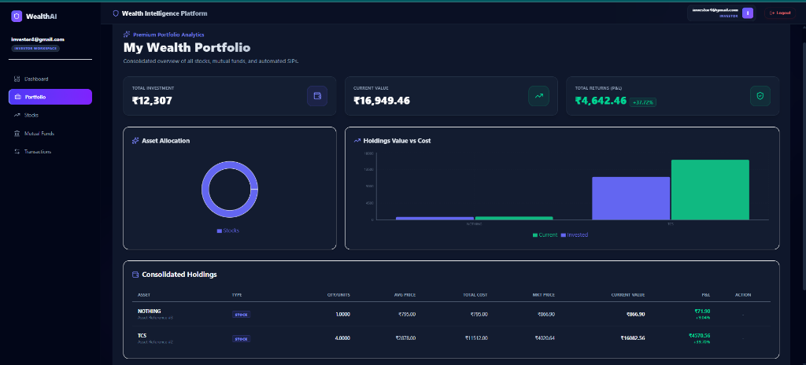

#### 2. Stocks Trading Center (`Stocks`)
Exposes list of active stocks, high-fidelity Recharts performance trend graphs, order placement panel, and in-place position portfolios.
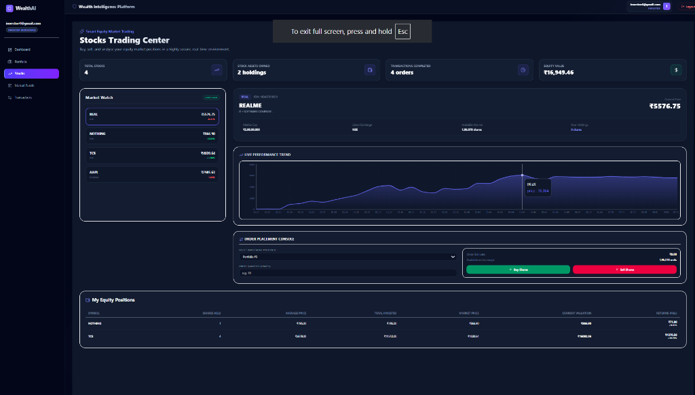

#### 3. Mutual Funds & Systematic Plans (`Mutual Funds`)
Responsive interactive grid displaying Axis Small Cap, ICICI Prudential Liquid, Parag Parikh Flexi, and other premium funds with risk badges.
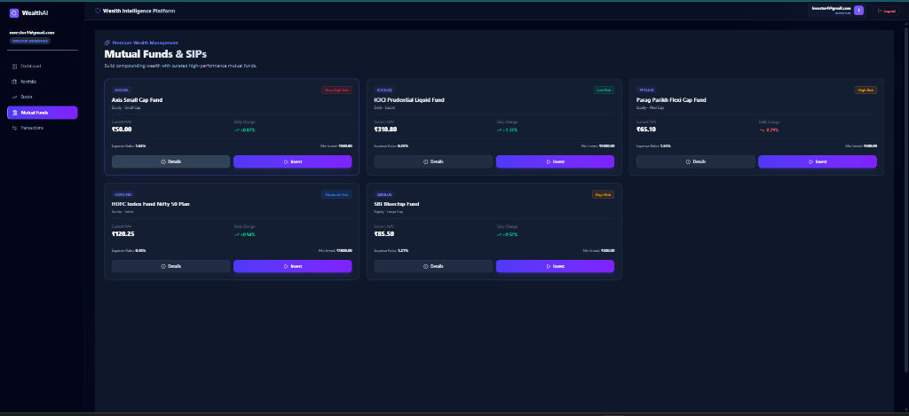

#### 4. Personal Cabinet & Profile Settings (`Profile Settings`)
Enables verified investors to update risk tolerability profiles, residential details, and mobile contact settings instantly.
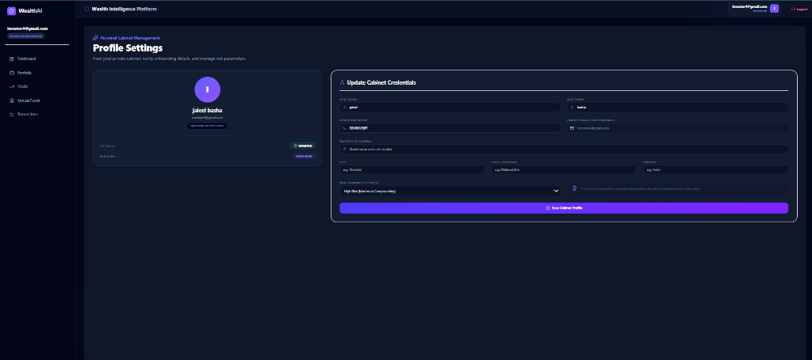

#### 5. Consolidated Order Logs (`Transactions`)
Centralized transaction audit list detailing historical completed equity orders and mutual fund SIP payments.
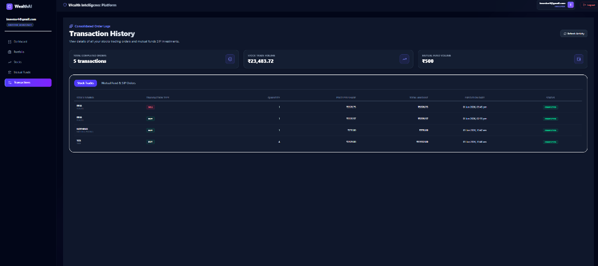

---

## 🏗️ High-Level System Architecture

The Wealth Intelligence Platform is structured as a robust multi-service monorepo. All frontend client requests feed into a centralized API Gateway which intercepts tokens, handles rate limits, writes system audit trails, and proxies requests to designated stock, auth, or mutual funds engine services.

### System Architecture Diagram
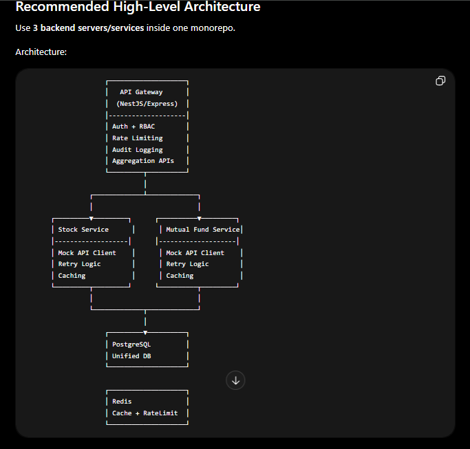

### Key Architectural Layers:
1. **API Gateway (Express Proxy Interceptor)**:
   - Evaluates JWT credentials & checks Role-Based Access Control (RBAC).
   - Async-persists HTTP operational metadata logs in the database.
   - Proxies backend communications.
2. **Stock & Holding Service**:
   - Manages active index stocks catalog and order execution ledgers.
   - Computes investor holdings distributions, valuations, and cost splits.
3. **Mutual Fund & SIP Service**:
   - Manages NAV charts performance trends.
   - Runs the daily Systematic Investment Plan (SIP) automated execution chron jobs.
4. **PostgreSQL (Unified Supabase Instance)**:
   - Core relational registry storing user models, active stock price ticks, transactions histories, and operational telemetry logs.

---

## 🚀 Architectural Port Configuration

All frontend requests route through the central **API Gateway** on port `4000`. The gateway interceptor decodes authorization headers, performs central HTTP request logging, and proxies requests to the appropriate microservice.

| Service | Port | Base Proxy Path | Responsibility |
| :--- | :--- | :--- | :--- |
| **API Gateway** | `4000` | `/` | Request proxying, JWT parsing, central audit logging |
| **Auth Service** | `5000` | `/api/auth`, `/api/investors` | User registration, login, profile updates, KYC, registries |
| **Mutual Fund Service** | `5001` | `/api/mutualfunds`, `/api/sips` | Mutual fund catalogs, NAV histories, buying, redeeming, SIP jobs |
| **Stock Service** | `5002` | `/api/stocks`, `/api/transactions` | Stock catalogs, order processing, portfolio allocations, holdings |

---

## 🔑 Phase 1: Authentication & Onboarding

Test these endpoints to register and authenticate users. **Note down the `token` returned from the Login response; you will use it as a Bearer Token for all subsequent protected endpoints.**

### 1. Register User (Investor)
* **HTTP Method**: `POST`
* **Path**: `http://localhost:4000/api/auth/register`
* **Headers**: `Content-Type: application/json`
* **Postman JSON Body**:
```json
{
  "email": "investor.demo@wealthai.com",
  "password": "SecurePassword123",
  "role_name": "investor",
  "first_name": "John",
  "last_name": "Doe",
  "phone": "+91 9876543210",
  "dob": "1994-08-15",
  "pan_number": "ABCDE1234F",
  "city": "Mumbai",
  "state": "Maharashtra",
  "country": "India",
  "risk_profile": "HIGH"
}
```

### 2. Register User (Admin)
* **HTTP Method**: `POST`
* **Path**: `http://localhost:4000/api/auth/register`
* **Headers**: `Content-Type: application/json`
* **Postman JSON Body**:
```json
{
  "email": "admin.security@wealthai.com",
  "password": "SecureAdminKey321",
  "role_name": "admin",
  "first_name": "Sarah",
  "last_name": "Connor",
  "phone": "+91 9999988888",
  "dob": "1988-12-01",
  "pan_number": "XYZWY5678A"
}
```

### 3. Decrypt & Sign In (Login)
* **HTTP Method**: `POST`
* **Path**: `http://localhost:4000/api/auth/login`
* **Headers**: `Content-Type: application/json`
* **Postman JSON Body**:
```json
{
  "email": "investor.demo@wealthai.com",
  "password_hash": "SecurePassword123"
}
```

### 4. Update Profile (Protected)
* **HTTP Method**: `PUT`
* **Path**: `http://localhost:4000/api/auth/profile`
* **Headers**: 
  * `Authorization: Bearer <YOUR_JWT_TOKEN>`
  * `Content-Type: application/json`
* **Postman JSON Body (Investor)**:
```json
{
  "first_name": "John",
  "last_name": "Doe Jr.",
  "phone": "+91 9876543210",
  "address": "Skyline Heights, Flat 402",
  "city": "Mumbai",
  "state": "Maharashtra",
  "country": "India",
  "risk_profile": "VERY HIGH"
}
```
* **Sample UI Screenshot**: [View Personal Cabinet & Profile Settings](screenshots/investor_profile.png)

---

## 📈 Phase 2: Stock Market & Holdings (Investor)

Make sure to attach your investor JWT token as a **Bearer Token** in Postman's **Authorization** tab.

### 1. Retrieve Listed Index Stocks
* **HTTP Method**: `GET`
* **Path**: `http://localhost:4000/api/stocks`
* **Headers**: `Authorization: Bearer <TOKEN>`
* **Sample UI Screenshot**: [View Stocks Trading Center](screenshots/investor_stocks.png)

### 2. Fetch Historical Stock Price Ticks
* **HTTP Method**: `GET`
* **Path**: `http://localhost:4000/api/stocks/1/history` (Replace `1` with an active `stock_id`)
* **Headers**: `Authorization: Bearer <TOKEN>`
* **Sample UI Screenshot**: [View Live Performance trend inside Stocks Trading Center](screenshots/investor_stocks.png)

### 3. Execute Stock Acquisition (Buy Order)
* **HTTP Method**: `POST`
* **Path**: `http://localhost:4000/api/transactions/buy`
* **Headers**: `Authorization: Bearer <TOKEN>`
* **Postman JSON Body**:
```json
{
  "stock_id": 1,
  "quantity": 10,
  "price": 3850
}
```
* **Sample UI Screenshot**: [View Stocks Trading Center & Order Placement Console](screenshots/investor_stocks.png)

### 4. Execute Stock Liquidation (Sell Order)
* **HTTP Method**: `POST`
* **Path**: `http://localhost:4000/api/transactions/sell`
* **Headers**: `Authorization: Bearer <TOKEN>`
* **Postman JSON Body**:
```json
{
  "stock_id": 1,
  "quantity": 5,
  "price": 3910
}
```
* **Sample UI Screenshot**: [View Stocks Trading Center & Order Placement Console](screenshots/investor_stocks.png)

### 5. Fetch Portfolio Holdings
* **HTTP Method**: `GET`
* **Path**: `http://localhost:4000/api/holdings`
* **Headers**: `Authorization: Bearer <TOKEN>`
* **Sample UI Screenshot**: [View Consolidated Portfolio Dashboard](screenshots/investor_portfolio.png)

### 6. Audit Signed Transactions Ledger
* **HTTP Method**: `GET`
* **Path**: `http://localhost:4000/api/transactions/history`
* **Headers**: `Authorization: Bearer <TOKEN>`
* **Sample UI Screenshot**: [View Consolidated Order Logs & Transaction History](screenshots/investor_transactions.png)

---

## 💰 Phase 3: Mutual Funds & SIP Allocations (Investor)

Invest, redeem, or schedule systematic installments for mutual funds. 

### 1. Retrieve Active Mutual Funds Catalog
* **HTTP Method**: `GET`
* **Path**: `http://localhost:4000/api/mutualfunds`
* **Headers**: `Authorization: Bearer <TOKEN>`
* **Sample UI Screenshot**: [View Mutual Funds & SIPs Catalog Grid](screenshots/investor_mutual_funds.png)

### 2. Fetch Mutual Fund NAV Chronological Trend
* **HTTP Method**: `GET`
* **Path**: `http://localhost:4000/api/mutualfunds/1/history` (Replace `1` with a `fund_id`)
* **Headers**: `Authorization: Bearer <TOKEN>`
* **Sample UI Screenshot**: [View Mutual Funds Grid](screenshots/investor_mutual_funds.png)

### 3. Acquire Mutual Fund Units (One-Time Lump Sum)
* **HTTP Method**: `POST`
* **Path**: `http://localhost:4000/api/mutualfunds/purchase`
* **Headers**: `Authorization: Bearer <TOKEN>`
* **Postman JSON Body**:
```json
{
  "fund_id": 1,
  "amount": 50000
}
```
* **Sample UI Screenshot**: [View Mutual Funds Grid & Purchase Console](screenshots/investor_mutual_funds.png)

### 4. Redeem Mutual Fund Units (Sell)
* **HTTP Method**: `POST`
* **Path**: `http://localhost:4000/api/mutualfunds/redeem`
* **Headers**: `Authorization: Bearer <TOKEN>`
* **Postman JSON Body**:
```json
{
  "fund_id": 1,
  "units": 15.42
}
```
* **Sample UI Screenshot**: [View Consolidated Portfolio Dashboard](screenshots/investor_portfolio.png)

### 5. Schedule a Systematic Investment Plan (SIP)
* **HTTP Method**: `POST`
* **Path**: `http://localhost:4000/api/sips/create`
* **Headers**: `Authorization: Bearer <TOKEN>`
* **Postman JSON Body**:
```json
{
  "fund_id": 1,
  "amount": 5000,
  "frequency": "MONTHLY",
  "start_date": "2026-06-15"
}
```
* **Sample UI Screenshot**: [View Mutual Funds Grid](screenshots/investor_mutual_funds.png)

### 6. Retrieve Investor's Active SIP list
* **HTTP Method**: `GET`
* **Path**: `http://localhost:4000/api/sips`
* **Headers**: `Authorization: Bearer <TOKEN>`
* **Sample UI Screenshot**: [View Consolidated Portfolio Dashboard](screenshots/investor_portfolio.png)

### 7. Pause, Resume, or Cancel a SIP Plan
* **HTTP Method**: `PUT`
* **Path**: `http://localhost:4000/api/sips/1/status` (Replace `1` with a `sip_id`)
* **Headers**: `Authorization: Bearer <TOKEN>`
* **Postman JSON Body**:
```json
{
  "status": "PAUSED" // Acceptable inputs: "ACTIVE", "PAUSED", "CANCELLED"
}
```
* **Sample UI Screenshot**: [View Consolidated Portfolio Dashboard](screenshots/investor_portfolio.png)

---

## 🛠️ Phase 4: Infrastructure Diagnostics & Audits (Admin Only)

**Attach your Admin JWT token as a Bearer Token for these endpoints.**

### 1. Stream Gateway Request Logs (Real-time Telemetry)
* **HTTP Method**: `GET`
* **Path**: `http://localhost:4000/api/admin/logs`
* **Headers**: `Authorization: Bearer <ADMIN_TOKEN>`
* **Sample UI Screenshots**: [View Admin Dashboard & Gateway Logs](screenshots/admin_dashboard.png) • [View Infrastructure Diagnostics & System Latency](screenshots/system_analytics.png)

### 2. Fetch Active Investor Accounts Database
* **HTTP Method**: `GET`
* **Path**: `http://localhost:4000/api/investors`
* **Headers**: `Authorization: Bearer <ADMIN_TOKEN>`
* **Sample UI Screenshot**: [View Investor Compliance Registry](screenshots/investor_registry.png)

### 3. Update Investor KYC Verification status
* **HTTP Method**: `PUT`
* **Path**: `http://localhost:4000/api/investors/1/kyc` (Replace `1` with an `investor_id`)
* **Headers**: `Authorization: Bearer <ADMIN_TOKEN>`
* **Postman JSON Body**:
```json
{
  "kyc_status": "VERIFIED" // Acceptable inputs: "VERIFIED", "PENDING", "UNVERIFIED"
}
```
* **Sample UI Screenshot**: [View Investor Compliance Registry](screenshots/investor_registry.png)

### 4. Create Stock Listing (Admin Catalog Init)
* **HTTP Method**: `POST`
* **Path**: `http://localhost:4000/api/stocks/create`
* **Headers**: `Authorization: Bearer <ADMIN_TOKEN>`
* **Postman JSON Body**:
```json
{
  "symbol": "RELIANCE",
  "company_name": "Reliance Industries Limited",
  "exchange": "NSE",
  "sector": "Energy & Petrochemicals",
  "industry": "Oil & Gas Refineries",
  "isin_number": "INE002A01018",
  "market_cap": 18000000000,
  "current_price": 2450,
  "available_quantity": 7346938
}
```
* **Sample UI Screenshot**: [View Manage Stocks Grid](screenshots/manage_stocks.png)

### 5. Update Stock Price / Parameters
* **HTTP Method**: `PUT`
* **Path**: `http://localhost:4000/api/stocks/1` (Replace `1` with a `stock_id`)
* **Headers**: `Authorization: Bearer <ADMIN_TOKEN>`
* **Postman JSON Body**:
```json
{
  "current_price": 2512.45,
  "sector": "Energy & Digital Conglomerate",
  "industry": "Oil, Gas & Telecom Services",
  "exchange": "NSE"
}
```
* **Sample UI Screenshot**: [View Live Pricing Ledger & Volatility Controller](screenshots/market_prices.png)

### 6. Expunge Security Listing (Delete)
* **HTTP Method**: `DELETE`
* **Path**: `http://localhost:4000/api/stocks/1` (Replace `1` with a `stock_id`)
* **Headers**: `Authorization: Bearer <ADMIN_TOKEN>`
* **Sample UI Screenshot**: [View Manage Stocks Grid](screenshots/manage_stocks.png)

---

## 🎯 Quick Postman Guide

1. **Environmental Variables**: Set a Postman Environment Variable named `token`.
2. **Dynamic chaining**: Paste the following script inside the **Tests** tab of your **Login** request in Postman. It will automatically capture and set the auth token for all subsequent queries!
```javascript
const response = pm.response.json();
if (response && response.token) {
    pm.environment.set("token", response.token);
    console.log("JWT Captured successfully!");
}
```
3. **Using Chained Headers**: In other requests, go to the **Authorization** tab, select **Bearer Token**, and input `{{token}}`. You are ready to execute!